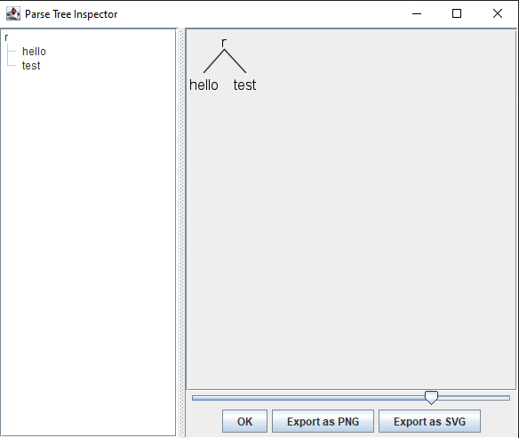
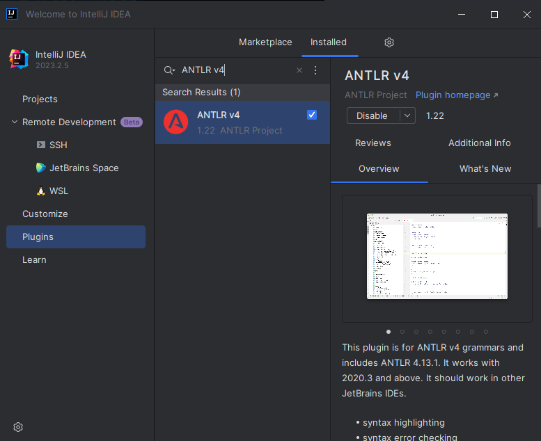
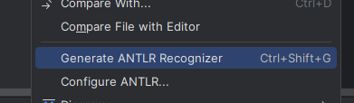
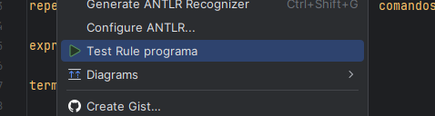
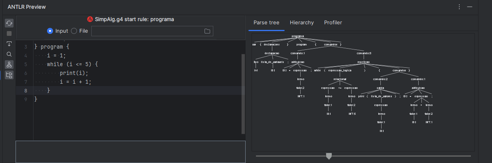

# Analisador lexico sintatico

<p align="center">
    
</p>
<p align="center">
    <a href="https://github.com/Ellemaamorim"></a>
    <a href="https://github.com/claudiney63"></a>
    <a href="https://github.com/viniciusmra"></a>
</p>

Repositório referente a implementação do analisador léxico e sintático de uma linguagem simplificada utilizando o ANTLR para a disciplina de Compiladores do curso de Ciência da Computação UFPI.
Professor Carlos André, periódo 2023.2.


##### Índice
[Baixando e configurando o ANTLR](#baixando-e-configurando-o-antlr)  
[Testando o ANTLR](#testando-o-antlr)  
[Utilizando o ANTLR no IntelliJ](#utilizando-o-antlr-no-intellij)  
[Testes](#testes)  
[Autores](#autores)

## Para instalar o pacote antlr4 no python, exdcute essa linha de codigo usando o pip:

```
pip install antlr4-python3-runtime
```

## Para gerar os tokens e parte do analisador usando a gramatica, execute esse codigo:

```
antlr4 SimpAlg.g4
```

## para gerar a arvore do parser, essas linha de codigo pode ser utlizada:

```
compile SimpAlg*.java
```

e logo após, essa linha:

```
grun SimpAlg programa -gui
```

irá abrir espaço para digitar os caracteres que serão categorizados(tokerização), ao terminar de escrever,
aperte CTRL + Z e ENTER. Note que "programa", pode mudar, considerando a regra inicial da gramatica.

## Exemplo para essa gramatica:

```
var {
    int a, b;
}
program {
    a = 10;
    b = 5 + a;
    print("Resultado: ", b);
}
```

## Imagem da arvore de derivação do exemplo acima:


## Baixando e configurando o ANTLR

Para baixar o ANTLR é necessário acessar o site `https://www.antlr.org/download.html`, ir até a seção  `ANTLR tool and Java Target` e baixar o arquivo `Complete ANTLR` (A versão pode variar).

Após baixar o arquivo `.jar`, é necessário criar uma pasta chamada `Javalib` e colocar esse arquivo dentro dela. É necessário criar mais três arquivos: `antlr4.bat`, `grun.bat` e `compile.bat` com o seguintes códigos:

`antlr4.bat`:
~~~
java org.antlr.v4.Tool %*
~~~

`grun.bat`:
~~~
@ECHO OFF
SET TEST_CURRENT_DIR=%CLASSPATH:.;=%
if "%TEST_CURRENT_DIR%" == "%CLASSPATH%" ( SET CLASSPATH=.;%CLASSPATH% )
@ECHO ON
java org.antlr.v4.gui.TestRig %*
~~~

`compile.bat`
~~~
@echo off

REM Compile java code that uses ANTLR4 classes
javac -classpath CAMINHO-PARA-.JAR;. %*
~~~

Onde `CAMINHO-PARA-.JAR` deve ser subistituído pelo caminho até o arquivo `.jar` que acabou de ser baixado e adicionado a pasta `Javalib`.

Exemplo
~~~
@echo off

REM Compile java code that uses ANTLR4 classes
javac -classpath C:\Javalib\antlr-4.13.1-complete.jar;. %*
~~~

Agora é necessário adicionar o ANTLR nas variáveis de ambiente.  Para isso é necessário criar uma variável do sistema chamada `CLASSPATH` e adicionar nela o caminho até o arquivo `.jar` dentro da pasta `Javalib`

Exemplo:
~~~
CLASSPATH
C:\Javalib\antlr-4.13.1-complete.jar
~~~

Depois é necessário editar adicionar mais dois valores a variável o sistema chamada `path`: `%CLASSPATH%` e o caminho até a pasta `Javalib`

Exemplo:
~~~
%CLASSPATH%
C:\Javalib
~~~

## Testando o ANTLR

Para testar se tudo está funcionando, é necessário  criar uma pasta com uma gramática dentro (arquivo Hello.g4). Essa gramatica vai ter as seguintes regras:
`Hello.g4`
~~~
grammar Hello;
r  : 'hello' ID ;         // match keyword hello followed by an identifier
ID : [a-z]+ ;             // match lower-case identifiers
WS : [ \t\r\n]+ -> skip ; // skip spaces, tabs, newlines
~~~

Agora basta abrir o terminal, navegar até essa pasta e executar os seguintes comandos, que irá gerar alguns arquivos na pasta, indicando que a operação deu certo
~~~
antlr4 Hello.g4
javac Hello*.java
grun Hello r -gui
~~~

O próximo passo é passar um código da linguagem para o analisador para que ele possa ser analisado. Para isso, pode-se escrever `hello test`, por exemplo e pressionar as teclas CTRL+Z, apertando ENTER em seguida. Isso passa o código pelo analisador e retorna a árvore de derivação.


Se tudo correr bem, a seguinte tela será exibida:
<p align="center">
    
</p>

## Utilizando o ANTLR no IntelliJ

Para utilizar o ANTLR no IntelliJ, basta instalar o plugin ANTLR4 indo na aba `plugins` e pesquisando por `ANTLR v4`:

<p align="center">
    
</p>

Depois, basta criar uma gramática (arquivo com extensão .g4), adicionar as regras, clicar com o botão direito do mouse eselecionar `Generate ANTLR Recognizer`

<p align="center">
    
</p>

Para analisar um código, basta abrir a gramática, clicar com o botão direito na primeira regra e selecionar `Test Rule`

<p align="center">
    
</p>

O plugin ANTLR4 vai abrir com um espaço para digitar o código a ser analisado e uma visão da árvore sintática.
<p align="center">
    
</p>

## Testes
Para visualizar os códigos de tests que foram utilizados, [clique aqui](lista-de-testes.md).

## Autores
<a href="https://github.com/Ellemaamorim"></a>
<a href="https://github.com/claudiney63"></a>
<a href="https://github.com/viniciusmra"></a>

